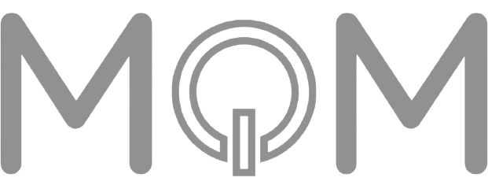

# Hi there, I'm Mario! 👋



Do you like my logo? It was created by using **Canva**. It's simple, I know, but it works don't you?

## Who's Mario 👤

  const P4c1us = {
    name: 'Mario',
    home: {
      city: 'somewhere in',
      country: 'Spain',
      zipCode: 24390,
      phone: ['personal', 'home']
    },
    hobbys: ['web design', 'motorsports', 'simracing', 'same as everyone'],
    markdown: 'I like this thing'
  }

## Work in progress... 🏗

```js
 const workingOn = {
  languages: ['HTML', 'CSS', 'JavaScript', 'PHP'],
  databases: ['MySQL', 'PostgreSQL', 'MongoDB'],
  frameworks: ['React']
 }
```

## Contact me for jobs stuffs, thanks 📫

[mariopaciosmartinez@gmail.com](mailto:mariopaciosmartinez@gmail.com)
